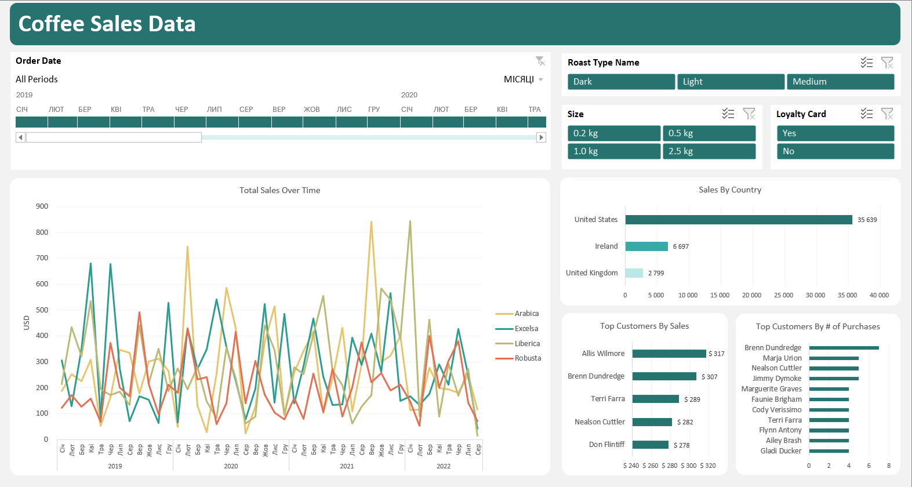

# ☕ Coffee Sales Dashboard

This project showcases a dynamic Excel dashboard built to analyze fictional coffee sales data. It integrates advanced Excel functions like `XLOOKUP`, `IF` logic, and PivotTables to simulate real-world business reporting. Though the dataset is synthetic, the dashboard structure reflects practical KPIs and customer segmentation strategies.

## 🎯 Project Objectives

- Demonstrate Excel capabilities for business analytics
- Build a dashboard using dynamic formulas and PivotTables
- Simulate customer behavior, product performance, and regional trends
- Practice data storytelling and insight generation

## 🧠 Excel Techniques Used

- `XLOOKUP` to pull customer and product details from supporting sheets
- `IF` statements for replacing the values conditional logic and segmentation
- PivotTables for aggregating sales metrics and enabling dynamic filtering
- Slicers for user-friendly interactivity
- Custom chart formatting and layout design

## 📈 Dashboard Overview

## 🔍 Key Insights & Recommendations

- **U.S. Market Dominance**
The United States leads in total sales, but it remains unclear whether this is driven by population size or regional marketing strategies. A deeper analysis could help determine whether targeted campaigns or demographic factors are responsible - guiding future investment in regional outreach.
- **Customer Segmentation Opportunity**
A noticeable gap exists between top customers by total sales and those by purchase frequency. This raises the question: are high-spending customers buying for personal use or business supply? Identifying these segments could allow the company to tailor offers - such as discounts for business clients and loyalty rewards for frequent buyers.
- **Loyalty Program Effectiveness**
Customers without loyalty cards currently account for the majority of purchases and revenue. This suggests the loyalty program may not be effectively incentivizing repeat purchases. The company should evaluate whether loyalty card ownership correlates with buying behavior, and consider redesigning the program to better engage and retain customers.
- **Seasonality & Inventory Strategy**
The sales-over-time chart reveals seasonal peaks, particularly in winter and spring. During high-demand months, inventory should be replenished more frequently to avoid stock-outs. In lower-sales periods, promotional strategies may need to shift — such as discounts or targeted campaigns

## 📁 Files Included

- `CoffeeSalesProject.xlsx`: Interactive dashboard
- `CoffeeSalesRawData.xlsx`: Original sales data used for analysis

## ⚠️ Disclaimer

This project uses sample data for demonstration purposes only. It is intended to showcase Excel proficiency and dashboard design. Real-world data projects are in development.

## 👤 About the Creator

Created by Anastasiia Sukhobok — a data enthusiast passionate about turning complexity into accessible insights.

Feel free to connect on [LinkedIn](https://www.linkedin.com/in/anastasiia-sukhobok/) or contact via [email](mailto:nastia.sukhobok@gmail.com)  :)

