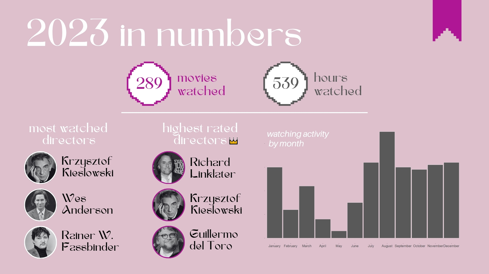
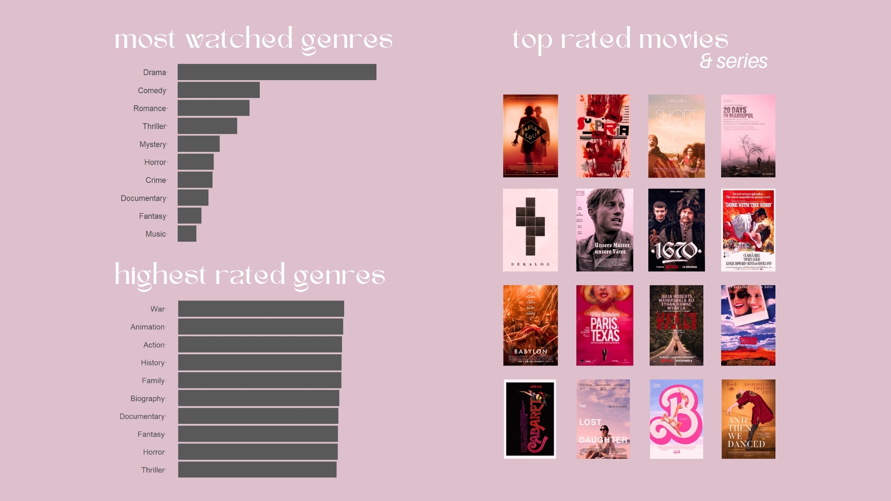

# 🎬 My Taste in Movies

This data project explores my movie-watching habits from 2018 to 2023 using data exported from IMDb. I analyzed trends in genres, directors, countries, and ratings — with a special focus on my 2023 viewing activity.

## 🧠 What I Wanted to Know

I approached this project with a few key questions:

- Which genres and countries dominate my watchlist?
- Do I rate movies by female directors differently than male ones?
- How has my viewing activity changed over time?
- What patterns emerge in my 2023 watch history?

To answer these, I cleaned and enriched my data, built visualizations, and ran statistical tests — including the Mann-Whitney test to compare rating distributions.

## 🛠️ Tools Used

- R (tidyverse, ggplot2, readxl)  
- Excel (for manual enrichment)  
- Canva (for presentation)

## 📁 Project Structure

- `overview_2018_2023.Rmd` – long-term trends in genres, directors, countries, and ratings  
- `2023_stats.Rmd` – focused analysis of 2023 viewing habits  
- `data/` – original ratings file exported from IMDb, plus a manually enriched version with country and director gender  
- `presentation/` – final slides with insights and exported visualizations

## 📊 Highlights

### General Overview

- **781 movies from 40 countries** watched between Dec 2018 and Dec 2023  
- **Top rated countries**: Hungary, Hong Kong, Poland, UK, Ireland  
- **Favorite decades**: 2010s, 1990s, 1940s  
- **Director gender split**: 85% male, 13.2% female  
- **Average rating**: 6.7 for both genders — confirmed with Mann-Whitney test  
- **Most watched directors**: Wes Anderson, Martin Scorsese, Woody Allen  
- **Highest rated directors**: Greta Gerwig, Damien Chazelle, Martin McDonagh  
- **Top genres**: Drama, Comedy, Romance

### 2023 Snapshot

Here are two slides summarizing my 2023 viewing activity:

  

  

## 📎 Presentation

You can view the full final presentation with visualizations made in R [here](https://drive.google.com/file/d/1_lDyWsw4EOKJJxkZbKkPoYDVzGSgOx5X/view?usp=sharing)

