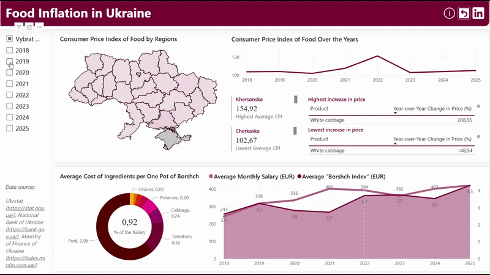

# 🥘 Food Inflation Analysis in Ukraine (2018–2025)

This project explores food price inflation in Ukraine over an eight-year period, with a focus on the economic impact before and after the full-scale russian invasion in 2022. Using SQL and Power BI, I analyzed consumer price trends, regional CPI fluctuations, and created a custom "Borshch Index" to visualize how inflation affects everyday meals.

## 🎯 Project Goals

- Investigate how food prices evolved from 2018 to 2025
- Compare inflation trends before and after 2022
- Highlight regional disparities and product-level volatility
- Make economic data accessible to the public through storytelling

## 📊 Tools & Technologies

- **PostgreSQL**: Data cleaning, aggregation, and view creation
- **Power BI**: Interactive dashboard design and DAX measures

## 📈 Key Insights

- **Regional CPI Trends**:  
  Khersonska oblast showed the most CPI fluctuation; Cherkaska the least. After 2022, CPI continued rising across Ukraine, except in Khersonska, which saw a decline in 2023 after a sharp spike.

- **Product Price Growth**:  
  Biggest over-the-year increases: white cabbage, onions, carrots.  
  Biggest decreases: white cabbage, beetroot, onions.

- **Price Volatility** *(Standard Deviation)*:  
  Most volatile: beef, frozen fish, cheese, domestic wines — all animal-origin products.  
  Least volatile: semolina, millet, barley groats, wheat flour — grain-based staples that became more stable post-2022.

- **Borshch Index vs. Salary**:  
  Highest burden in 2018 (1.07% of avg salary), next highest in 2023 (1.04%).  
  Lowest in 2021 (0.68%).  
  From 2019–2021, salaries rose and borshch got cheaper. In 2022, prices spiked and remained high through 2023. In 2025, borshch ingredients again outpaced salary growth.

- **Ingredient Cost Breakdown**:  
  Most expensive: pork and tomatoes.  
  Least expensive: sunflower oil and onions.

## 🍲 What is the Borshch Index?

A playful but powerful inflation indicator based on the cost of ingredients for a 4–5 liter pot of traditional Ukrainian borshch. Though unofficial, it’s widely referenced in Ukrainian media — and in this project, calculated from scratch using weighted proportions:

```text
borshch_index = pork*0.5 + sunflower_oil*0.03 + potatoes*0.5 + onions*0.15 + cabbage*0.5 + beetroot*0.3 + carrots*0.15 + tomatoes*0.3
```

## 📥 Deliverables
• 	📊 [Download the Power BI Dashboard or the PDF version of it (.pbix)](https://github.com/staceoddity/portfolio.github.io/tree/8a96801e45f7db332b8518f9503333e14de917ee/Data%20Analysis%20in%20SQL%20and%20Power%20BI.%20Food%20Inflation%20in%20Ukraine/Deliverables)

## 🎥 Dashboard Demo
Watch how filters and slicers reveal regional CPI trends and product-level inflation.



## 📚 Data Sources
• 	[Ukrstat](https://stat.gov.ua/uk/explorer?urn=SSSU%3ADF_PRICE_CHANGE_CONSUMER_GOODS_SERVICE)
• 	[National Bank of Ukraine](https://bank.gov.ua/en/markets/exchangerate-chart?cn%5B%5D=EUR&startDate=01.01.2017&endDate=26.07.2025)
• 	[Ministry of Finance of Ukraine](https://bank.gov.ua/en/markets/exchangerate-chart?cn%5B%5D=EUR&startDate=01.01.2017&endDate=26.07.2025)

## 👤 About the Author
Created by Anastasiia Sukhobok — a data enthusiast passionate about turning complexity into accessible insights.

Feel free to connect on [LinkedIn](https://www.linkedin.com/in/anastasiia-sukhobok/) or contact via [email](mailto:nastia.sukhobok@gmail.com)  :)


